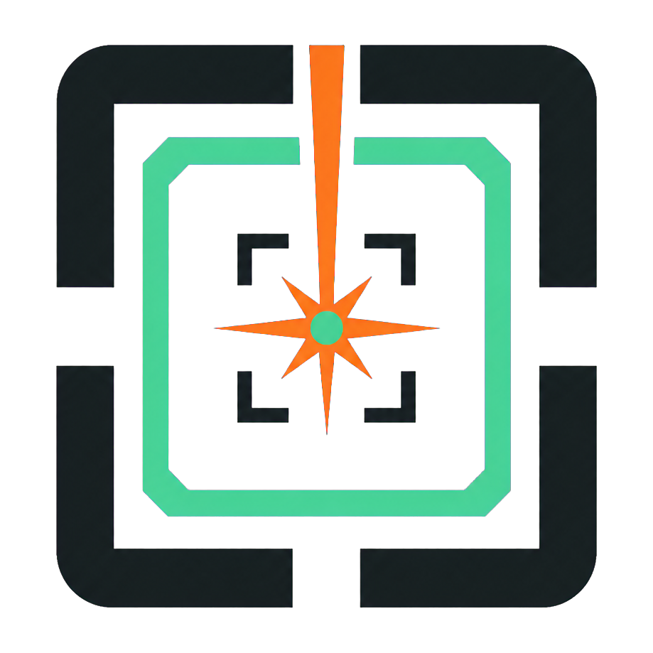

# Lalikul Cut Prep

  

A local Windows demo that converts an image of a laser cutter bed into motif centres and cut squares or rectangles that can be exported as SVG.

The initial configuration uses an **Epilog Fusion Maker 36**, a **36 x 24 in** bed, and a global cut size of **5 x 5 in**. You can also create custom machine profiles, change working units, and adjust the cut size.

> **Project status:** functional validation prototype. It does not control the laser cutter, start cutting jobs, or configure power, speed, frequency, focus, or materials.

## Documentation for users and developers

The documentation is split so that non-technical users do not have to read development details:

- This `README.md` explains what the app does, how to install it, and how to use it. It is also the project homepage on GitHub.
- The complete user manual is available in both languages:
  - [English user manual](docs/Lalikul_Cut_Prep_User_Manual_EN.docx)
  - [Spanish user manual](docs/Lalikul_Cut_Prep_Manual_de_usuario_ES.docx)
  Both editions include detailed instructions, screenshots, states, settings,
  navigation controls, automatic overlap correction, and troubleshooting guidance.
- The [developer guide](docs/DEVELOPER_GUIDE.md) describes the architecture, virtual environment, tests, and technical decisions.

## Quick start for Windows users

### 1. Download and extract

On GitHub, select **Code -> Download ZIP**. Extract the entire ZIP to a normal folder before continuing. Do not run the application from inside the ZIP file.

### 2. Install Python

Install [Python for Windows](https://www.python.org/downloads/windows/) 3.10 or later. During installation, enable **Add python.exe to PATH**.

### 3. Set up the application once

Double-click `setup.bat` and wait for the `Setup complete` message.

The setup script creates `.venv`, a private Python environment for this application, and installs PySide6, OpenCV, and NumPy. It does not install Node.js or create a web server.

### 4. Open the app without a terminal

Double-click **`Lalikul Cut Prep.lnk`**, which `setup.bat` creates automatically in the main folder.

This is the recommended launcher. It displays the Lalikul Cut Prep icon and opens the interface through `pythonw.exe`, without leaving a terminal window visible or using Python's generic icon.

Alternative launchers are also available:

- `Lalikul Cut Prep.vbs` starts the app without a terminal if the shortcut is unavailable, although Windows Explorer displays a generic VBS icon for the file.
- `run.bat` delegates to the same hidden launcher and closes immediately. Windows may briefly flash a console because `.bat` files run through `cmd`.
- `run_console.bat` deliberately keeps the terminal open to display technical errors. Use it only for troubleshooting.

## Typical workflow

1. Select the machine and confirm **Work Area** and **Working units**.
2. Load an image using **Paste Image**, `Ctrl+V`, **Open Image**, or **Demo Image**.
3. If necessary, clear **Lock image placement** to move the image or scale it from its corners without distorting it. Lock it again when finished.
4. Select **Detect**.
5. Review the centres and cut shapes. Move them, add manual centres, or disable detections when needed.
6. Resolve every red or orange cut. When collisions exist, use **Fix Overlaps** to
   separate them automatically, or drag individual cuts to arrange them manually.
7. Select **Verify Export**.
8. Select **Export SVG** and confirm its physical size when importing it into the receiving software.

## Zooming and panning like Illustrator

The canvas is not a fixed view. Open **Navigation controls** in the bottom-left
corner of the workspace to see these controls at any time. The compact guide
floats over the canvas, so opening it never moves or resizes the bed. It opens only
when selected and is never shown automatically when the pointer is idle.

You can zoom into the workspace and pan without changing any physical coordinates:

| Action | Windows control |
|---|---|
| Temporary Hand tool | Hold `Space` and drag |
| Hand tool | Press `H` and drag |
| Alternative pan | Drag with the middle mouse button |
| Zoom tool | Press `Z` and click |
| Zoom out with the Zoom tool | `Alt + click` |
| Zoom at the pointer | `Ctrl + mouse wheel` |
| Zoom in / out | `Ctrl + =` / `Ctrl + -` |
| Fit the entire bed | `Ctrl + 0` |
| Return to normal editing | `V` or `Esc` |

The mouse wheel without `Ctrl` pans vertically; `Shift + mouse wheel` pans horizontally. Zooming is centred on the pointer so that the area being inspected stays in view.

These controls follow the main navigation shortcuts in [Adobe Illustrator](https://helpx.adobe.com/illustrator/using/default-keyboard-shortcuts.html), adapted to this application's physical bed.

## Epilog Copy Background Image

The demo **does not connect directly to Epilog cameras**. It is designed to reuse the image that Epilog Dashboard copies to the Windows clipboard:

**Epilog Dashboard -> Copy Background Image -> Windows clipboard -> Lalikul Cut Prep -> Ctrl+V -> detection -> cut shapes -> SVG**

Epilog explains that **Copy Background Image** uses the IRIS camera system to capture the bed so the image can then be pasted into another application. In this workflow, Lalikul Cut Prep is that receiving application. See [Epilog's official explanation](https://support.epiloglaser.com/laser-machine/fusion-galvo/usage-and-operation/how-and-when-to-use-the-copy-background-image-feature/).

## Colour meanings

| Colour | State | Action |
|---|---|---|
| Green | Valid cut | Ready for export. |
| Yellow | Selected detection | Inspect or move it. |
| Orange | Collision | Separate the cuts or disable one of them. |
| Red | Outside the bed | Move the centre or reduce the cut size. |
| Grey | Disabled | Excluded from export while disabled. |

Two enabled cuts are considered to collide if they overlap or if their edges touch exactly. Both change to `COLLISION` and are excluded from the SVG until the issue is resolved.

When at least one collision exists, **Fix Overlaps** appears in the top toolbar.
It keeps each detected visual centre as an anchor, leaves collision-free cuts in
place, and shares the minimum required movement between colliding cuts. This keeps
the complete arrangement as close as possible to the original motifs instead of
arbitrarily pinning one cut and moving another. If there is not enough free space
on the bed, the remaining cuts stay orange and can be dragged manually or disabled.
Automatic placement never prevents later manual editing.

## Main controls

### Machine / Work Area

- **Machine** selects the profile that defines the physical bed.
- The built-in **Epilog Fusion Maker 36** profile uses the manufacturer's stated
  maximum engraving area of **36 x 24 in** (approximately 915 x 610 mm), as listed
  in the [official Epilog 17000 Series manual](https://www.epiloglaser.com/es/assets/downloads/manuals/17000-series_manual.pdf).
- **Add machine...** saves custom profiles with a name, width, height, and unit.
- **Working units** changes visible measurements between inches, centimetres, and millimetres.
- The origin is at the top-left corner. X increases to the right and Y increases downwards.

### Bed / Image

- The image is loaded centred and contained within the bed while preserving its aspect ratio.
- **Lock image placement** protects the image while cut shapes are being edited.
- When unlocked, drag inside the image to move it or drag a corner to scale it.
- **IMAGE SCALE** shows how many pixels represent one physical unit horizontally and vertically.
- A motif centre is calculated from the geometric centre of its complete detected
  visual extent, preventing dense lower areas in ships, violins, or machines from
  pulling the centre away from the artwork's middle.

### Global Cut Size

- The default value is **5 x 5 in**.
- With **Keep cut square** enabled, you can edit either Width or Height; the other measurement updates automatically.
- Disable it to create freely sized rectangles.

### Detection Settings

| Setting | Default | Purpose |
|---|---:|---|
| Sensitivity | 65 | Detects differences from the background. |
| Minimum area | 500 px² | Discards groups that are too small. |
| Cleanup | 25% | Reduces noise and closes small gaps. |
| Merge distance | 0.35 in | Groups nearby fragments belonging to the same motif. |

Double-click any of these controls to restore its default value. After changing a setting, select **Detect** again.

## Manual editing

- Click a centre or cut shape to select it, then drag it to move it.
- If cuts collide, either select **Fix Overlaps** or continue arranging them manually.
- Enable **Add Center** and click on the bed to create a manual detection.
- Press **Delete** to remove the selection.
- Use **Clear Detections** to remove every detection.
- Use **Include in export** to disable a cut without deleting it.

## Export and verification

The SVG contains only cuts that are:

- enabled;
- completely inside the bed;
- free from collisions.

It does not include the photograph, text, centres, labels, or detection bounding boxes.

By default, **Export units** uses the same unit as **Working units**. The app displays a warning if you choose a different unit. Always verify the bed size in the receiving software.

**Verify Export** reconstructs the SVG geometry in pixels and displays the maximum round-trip error across image -> physical coordinates -> SVG -> image. A purple outline lets you compare the result visually.

**Write debug JSON beside SVG** creates an additional diagnostic file containing coordinates, scales, and states.

## In-app help

- Select the small circular information icons to open explanations in English.
- Keep the pointer still over a top-toolbar button for approximately 1.3 seconds to display its help text.

## Troubleshooting

### The application reports a missing or broken environment

Run `setup.bat` again. If Python has been uninstalled, reinstall it first.

### Ctrl+V does not load the image

Return to Epilog Dashboard, select **Copy Background Image**, and paste immediately. You can also use **Open Image** with a PNG, JPG, JPEG, or BMP file.

### The application does not open and the hidden launcher gives no reason

Run `run_console.bat`. The terminal will remain open and display the technical error.

### The imported SVG has the wrong size

Match **Export units** to **Working units** and verify the page size during import.

## Current limitations

- There is no direct connection to the cameras, Epilog Dashboard, PrintAPI, or laser cutter.
- The detector uses OpenCV, not YOLO or a trained model.
- There is no perspective or homography correction.
- The image-to-bed relationship, origin, and SVG must be physically validated before production use.
- The default profile is Epilog Fusion Maker 36, but additional machines can be added.

## Development and testing

Technical information is kept outside this main guide so that the page remains useful to non-technical users. See [docs/DEVELOPER_GUIDE.md](docs/DEVELOPER_GUIDE.md) for PowerShell environment setup, code structure, and test instructions.

## Release status

Before distributing a production release publicly, the project should add a signed installer, an explicit licence, versioning, and a release section. This folder currently contains a local validation demo, not a certified production package.
